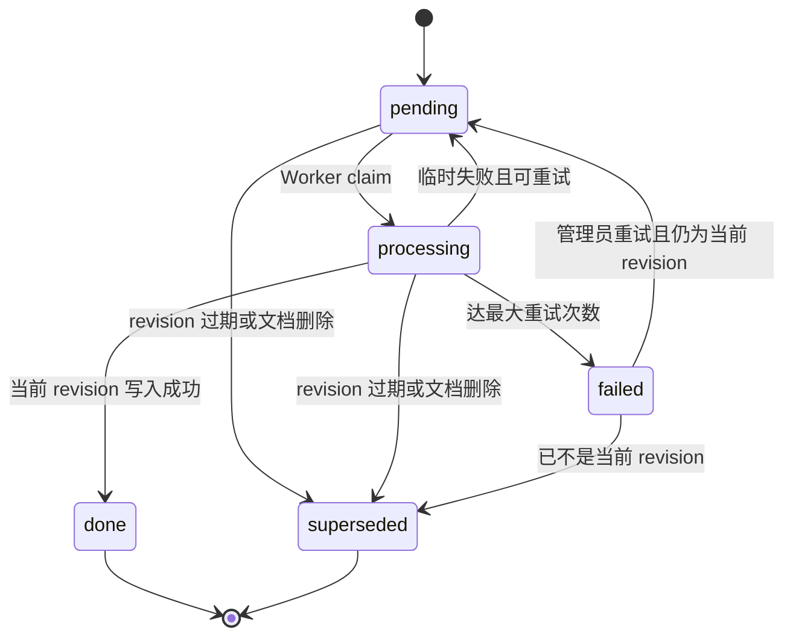

# 文档 Revision 与删除最终一致性设计

> 对应问题：#6 旧 Worker 写回旧向量、#7 删除清理失败后仍可检索  
> 适用项目：`vectorDatabase`  
> 状态：设计稿，评审通过前不实施  
> 日期：2026-06-22

---

## 1. 背景

当前系统使用 PostgreSQL 保存文档、chunk 和 embedding job，Qdrant 保存向量与检索 payload。两套存储之间不存在分布式事务。

现有更新流程会替换 PostgreSQL chunks、创建新 job，并同步删除 Qdrant 旧 points；现有删除流程先软删除 PostgreSQL 文档，再通过进程内后台任务删除 Qdrant points。这带来两个确定性问题：

1. **旧 Worker 写回旧向量**：Worker 已读取旧 chunks 并开始 embedding 时，文档可能被更新。API 删除旧 points 后，旧 Worker 仍可能把旧向量重新写入。
2. **删除后仍可检索**：PostgreSQL 已将文档标记为 deleted，但 Qdrant 清理失败时，检索只读 Qdrant，不会检查 PostgreSQL，已删除内容仍可能返回。

本设计不尝试在 PostgreSQL 和 Qdrant 之间实现不可行的强分布式事务，而是采用：

- PostgreSQL 作为文档身份、当前 revision 和逻辑可见性的事实来源。
- Qdrant 作为可重建的派生索引。
- document revision 防止过期 job 改写当前状态。
- PostgreSQL tombstone 保证删除后立即逻辑不可见。
- transactional outbox 保证 Qdrant 物理清理最终完成。
- 所有跨存储操作幂等、可重试、可观测。

---

## 2. 目标与非目标

### 2.1 目标

- 文档更新后，旧 revision 的 Worker 不能将文档状态改回 ready，也不能在最终状态中留下可检索旧向量。
- 删除接口提交成功后，后续检索立即不返回该文档。
- Qdrant 暂时不可用时，删除请求仍可完成逻辑删除，物理清理由 outbox 自动重试。
- Worker、cleanup worker 重复执行不会造成错误。
- 更新、删除、重建、重试和 Worker 崩溃都有明确状态机。
- 兼容当前字符串状态字段和 `FOR UPDATE SKIP LOCKED` 队列模式。

### 2.2 非目标

- 不实现 PostgreSQL 与 Qdrant 的 exactly-once 分布式事务。
- 不要求删除接口等待 Qdrant 物理删除完成。
- 本阶段不实现完整文档历史浏览和原文件版本管理。
- 本阶段不解决 rerank score threshold 契约问题。
- 本阶段不引入 Kafka、RabbitMQ 等外部消息系统。

---

## 3. 核心语义

### 3.1 Revision 定义

`documents.current_revision` 表示该文档当前应当生效的**索引版本**，不是「正文版本」。
凡是会改变写入 Qdrant 的内容（向量**或 payload**）的操作都必须递增 revision：

- 正文、标题、metadata 变化后重新切块。
- **任何会进入 payload 的字段变化**：title、过滤字段、ACL/权限标记、来源信息等——
  只要它影响检索、权限或展示，**即便正文未变也必须递增 revision**（否则旧 payload 残留在
  Qdrant，造成过滤/权限/展示与 PG 不一致）。
- 强制 re-embed。
- parser/chunk 策略变化后重新解析。
- collection 重建后重新写入向量。
- embedding 模型、维度或索引配置变化导致旧向量失效。

只有「正文**与全部 payload 字段**都未变」的 external_id no-op 才不递增 revision。

> 注：纯 metadata/payload 变更当前会触发一次完整 re-embed（切块相同、向量重算，幂等但有成本）。
> 后续可优化为「仅重写 payload、不重算向量」的轻量更新，但仍须递增 revision。

### 3.2 可见性规则

可见性按**库级 `lifecycle_mode`**（见 §4.5）分流，**不**靠 payload 是否「碰巧带 document_id」来推断：

- **`managed`（默认）**：points 由本系统 `documents`/`embedding_jobs` 管理。一个 point 只有
  同时满足以下条件才可返回：
  1. payload 带 `document_id`，且能在 PostgreSQL 查到对应文档。
  2. `documents.deleted_at IS NULL`。
  3. payload `document_revision == documents.current_revision`（缺失按过渡策略视作 1，见 §11）。
  4. 文档属于当前知识库。

  managed 库里 payload **缺 document_id / 查不到文档**视为数据异常 → **丢弃**
  （删除保护优先，不放过格式异常的内部 point）。
- **`external`**：points 由外部系统 / 源库补全管理（如 `case_chunks` 走 `cpwsdata` 回查正文，
  payload 只有 `case_id` 等外键、无 `document_id`）。本系统不掌握其生命周期，这类库
  **整体绕过 PG 生命周期过滤**，并**明确不享受删除 / revision 一致性保证**。

对 managed 库，Qdrant 中存在 point 不代表逻辑可见，PostgreSQL 是最终可见性事实来源。

### 3.3 删除语义

删除接口返回 204 代表：

- PostgreSQL 已记录 tombstone。
- cleanup outbox 已在同一事务中写入。
- 检索立即不再返回该文档。

它不承诺 Qdrant points 已在返回前物理删除。物理清理是最终一致的。

---

## 4. 数据模型

### 4.1 documents

新增：

```text
current_revision INTEGER NOT NULL DEFAULT 1
```

约束：

```text
CHECK (current_revision >= 1)
```

保留现有 `status` 字符串字段。建议状态语义：

| 状态 | 含义 |
|---|---|
| `pending` | 当前 revision 已创建，等待 Worker |
| `processing` | 当前 revision 正在 embedding |
| `ready` | 当前 revision 已成功写入 Qdrant |
| `failed` | 当前 revision 达到最大重试次数 |
| `deleted` | PostgreSQL tombstone，逻辑不可见 |

文档状态只能由与 `current_revision` 匹配的 job 更新。旧 job 不得修改文档状态。

### 4.2 embedding_jobs

新增：

```text
document_revision    INTEGER NOT NULL
rebuild_operation_id UUID NULL REFERENCES rebuild_operations(id) ON DELETE RESTRICT
                                            -- 非空=本 job 由某次 rebuild operation 创建（见 §4.6 / §5.1）
```

`ON DELETE RESTRICT`：禁止删除仍被 job 引用的 operation——否则删 operation 会让带
`rebuild_operation_id` 的旧 job 「变回」普通 job（`IS NULL` 语义错乱），在库 `ready` 时被误执行。

`rebuild_operation_id`：
- 普通摄入/更新创建的 job 为 `NULL`。
- rebuild operation 创建的 job 填该 operation 的 id。
- 资格条件（§5.1）：`ready` 时要求 `rebuild_operation_id IS NULL`，`rebuilding` 时要求
  `rebuild_operation_id == library.active_rebuild_operation_id`。
- 因此**带 `rebuild_operation_id` 的 job 在库 `ready` 时永不执行**——即便某次失败 operation 的
  遗留 job 被管理员重试，也只会再次判定 superseded，不会把过期重建结果写回。

新增状态：

```text
superseded
```

`superseded` 表示 job 对应的 revision 已不是文档当前 revision（或在重建期间不属于当前 operation），
任务正常终止，不属于失败，不应重试。

活动任务部分唯一索引：

```text
UNIQUE (document_id, document_revision)
WHERE status IN ('pending', 'processing')
```

它用于防止同一文档 revision 被并发创建多个活动 job。历史 `done/failed/superseded` 记录保留。

operation 文档快照唯一约束（finalize 靠计数，必须防重复 job）：

```text
UNIQUE (rebuild_operation_id, document_id)
WHERE rebuild_operation_id IS NOT NULL
```

保证一个 rebuild operation 内每篇文档至多一条 job——否则重复 job 会让
`done 数 == expected_job_count` **提前成立**、把库误判完成切回 `ready`。

### 4.3 Qdrant payload

系统保留字段新增：

```json
{
  "document_revision": 3
}
```

该字段由系统最后写入，用户 metadata 不允许覆盖。

已有保留字段仍包括：

- `library_id`
- `document_id`
- `chunk_id`
- `seq`
- `text`
- `title`
- `external_id`
- `document_revision`

### 4.4 qdrant_cleanup_outbox

新增表：

```text
qdrant_cleanup_outbox
----------------------
id                UUID PRIMARY KEY
event_type        VARCHAR(48) NOT NULL
library_id        UUID NOT NULL
document_id       UUID NULL
collection_name   VARCHAR(128) NOT NULL
target_revision   INTEGER NULL
payload           JSONB NULL
idempotency_key   VARCHAR(255) NOT NULL UNIQUE
status            VARCHAR(16) NOT NULL DEFAULT 'pending'
attempt_count     INTEGER NOT NULL DEFAULT 0
available_at      TIMESTAMPTZ NOT NULL DEFAULT now()
worker_id         VARCHAR(128) NULL
claimed_at        TIMESTAMPTZ NULL
finished_at       TIMESTAMPTZ NULL
last_error        TEXT NULL
created_at        TIMESTAMPTZ NOT NULL DEFAULT now()
```

索引：

```text
(status, available_at)
WHERE status IN ('pending', 'processing')
```

事件类型：

| event_type | 用途 | 删除范围 |
|---|---|---|
| `delete_document_all` | 文档删除 | 指定 document_id 全部 points |
| `delete_document_before_revision` | 文档更新/重解析 | 指定 document_id，revision 缺失或 `< target_revision` |
| `delete_collection` | 知识库删除 | 指定 collection |

`collection_name` 必须是由不可变 library UUID（或 collection generation）生成的物理名称，不能只用可重复的 slug。已进入 `delete_collection` outbox 的物理名称永不复用，避免延迟事件误删后来创建的同名 collection。

幂等键固定为：

```text
delete-document:{document_id}
delete-before-revision:{document_id}:{target_revision}
delete-collection:{physical_collection_name}
```

状态：

```text
pending -> processing -> done
                      -> pending（可重试）
                      -> failed（超过上限）
```

cleanup job 必须可重复执行。Qdrant 已无目标 point 或 collection 不存在时视为成功。

### 4.5 sys_libraries

新增三列：

```text
lifecycle_mode            VARCHAR(16) NOT NULL DEFAULT 'managed'  -- managed | external
                          CHECK (lifecycle_mode IN ('managed','external'))
index_state               VARCHAR(16) NOT NULL DEFAULT 'ready'    -- ready | rebuilding | failed
                          CHECK (index_state IN ('ready','rebuilding','failed'))
active_rebuild_operation_id UUID NULL REFERENCES rebuild_operations(id)  -- 当前进行中的 operation（§4.6）
```

> 循环外键（`sys_libraries.active_rebuild_operation_id` ↔ `rebuild_operations.library_id`）的迁移
> 创建顺序见 §11.1：先建表（不带回指 FK）→ 再 `ALTER TABLE ADD CONSTRAINT` 补 FK。

- `lifecycle_mode` 决定该库是否参与 §3.2 / §7.2 的 PG 生命周期可见性过滤：
  - `managed`：参与过滤，享受删除 / revision 一致性保证（绝大多数内部库）。
  - `external`：**只绕过文档 revision/tombstone 回查**，由外部系统 / 源库补全管理；通常与
    `source_config`（跨库正文补全）同时使用。必须由超管**显式**设置，避免误把内部库标成 external。
    **注意：`external` 不绕过知识库权限校验（Casbin），鉴权与 managed 库完全一致。**
  - **`external` 库禁止本系统改其生命周期**：上传 / 更新 / 删除 / rebuild **一律返回 409**
    （collection 由外部系统管理，本系统不得增删改其向量或 collection）。
    **rebuild 尤其绝不能对 external 库 `delete_collection`**（否则会误删 `case_chunks_000` 等外部 collection）。
    Casbin 鉴权仍照常执行（先鉴权、再因 external 拒绝）。
- `index_state` 见 §9：重建期间置 `rebuilding`，查询返回 503；仅当本次 operation 的全部当前
  revision job 都 done 后才回 `ready`。
- `active_rebuild_operation_id`：`rebuilding` 时指向当前 operation（§4.6）；资格条件（§5.1）据此
  只放行本次重建自己的 job。`ready` 时为 `NULL`。

> 库归属用**显式 `lifecycle_mode`**，不再用「payload 是否缺 document_id」推断——后者会让
> 格式异常的内部 point 误绕过删除保护（判断 4）。

### 4.6 rebuild_operations（持久化重建记录）

重建是持久化、可重试、**分三阶段**的 operation（prepare / qdrant / activate，见 §9），不是一次性请求：

```text
rebuild_operations
------------------
id                 UUID PRIMARY KEY
library_id         UUID NOT NULL REFERENCES sys_libraries(id)
collection_name    VARCHAR(128) NOT NULL          -- 本次重建写入的物理 collection 名
status             VARCHAR(16) NOT NULL DEFAULT 'preparing'
                   CHECK (status IN ('preparing','running','done','failed'))
expected_job_count INTEGER NOT NULL DEFAULT 0     -- activate 时建的 job 数；finalize 据此判完成
created_at         TIMESTAMPTZ NOT NULL DEFAULT now()
finished_at        TIMESTAMPTZ NULL
last_error         TEXT NULL
```

约束：
- **每个库至多一个进行中 operation**：`UNIQUE (library_id) WHERE status IN ('preparing','running')`。
- `status` CHECK 如上。

为什么**不**用 `target_revisions JSONB`：几万文档会形成超大单行、更新昂贵。改为
**以 jobs 本身作为 revision 快照**——该 operation 创建的每条 job 都带
`rebuild_operation_id` 与其 `document_revision`；operation 只存 `expected_job_count` 供
finalize 判定（done 的本-operation job 数 == `expected_job_count` 即完成）。

生命周期（详见 §9 三阶段）：
- prepare 事务：建 `preparing` 记录 + 设 `index_state='rebuilding'` + `active_rebuild_operation_id` +
  各活动文档 `current_revision += 1` + 旧 job superseded（**不**碰 Qdrant）。
- 事务外：删/建 Qdrant collection。
- activate 事务：为每篇活动文档建一条带 `rebuild_operation_id` 的 job、写 `expected_job_count`、
  operation→`running`。资格条件（§5.1）要求 `operation.status=='running'` 才放行这些 job。
- **重试**同一 operation：复用已递增的 `current_revision`（jobs 已是目标 revision），**不再递增**；
  只有显式发起**全新**重建才递增。
- finalize（§9）：done 的本-operation job 数达 `expected_job_count` → operation `done`、
  `index_state='ready'`、`active_rebuild_operation_id=NULL`；任一 job 终态 failed 或 collection
  操作失败 → operation `failed`、`index_state='failed'`，检索该库返回 503，不暴露半成品。

---

## 5. Embedding Job 状态机



### 5.1 任务资格条件（claim 与最终写入统一）

Worker 的 **claim**、**embedding 前检查**与**最终写入前检查**必须使用**同一条资格条件**
（eligibility predicate）。它是任务的**准入条件**，不是可选加固：

```text
document.deleted_at IS NULL
AND job.document_revision == document.current_revision
AND (
    (
        library.index_state == 'ready'
        AND job.rebuild_operation_id IS NULL
    )
    OR (
        library.index_state == 'rebuilding'
        AND job.rebuild_operation_id == library.active_rebuild_operation_id
        AND operation.status == 'running'          -- 该 operation 已 activate（见 §9 三阶段）
    )
)
```

强制语义：

- **`ready` 时只有普通 job（`rebuild_operation_id IS NULL`）可执行**。这道 `IS NULL` 防御不可省：
  否则某次失败 rebuild operation 的遗留 job 被管理员重试后，会在库已回到 `ready` 时被再次执行，
  把过期的重建结果写回。
- **`rebuilding` 期间，普通 embedding job 一律不得执行**——只有「本次 rebuild operation
  创建的、且该 operation 已 `running`」的 job 可执行（`rebuild_operation_id == active_rebuild_operation_id`
  **且** `operation.status == 'running'`）。`preparing` 阶段尚未建 job，亦不放行。
- 普通上传 / 更新 / 删除在 `rebuilding` 期间**拒绝或延后**（见 §9，503 + `Retry-After`），不得产生可执行的普通 job。
- 仅当本次 rebuild operation 的**全部 job 完成**后，库才转 `ready`，普通 job 方可恢复执行。
- `index_state == 'failed'`：**所有 job 都不可执行**（两个分支都不满足），统一 `superseded`。
- 任何时刻不满足上式 → job 直接标 `superseded`（不调 embedding、不计失败次数）。

claim 用 `FOR UPDATE SKIP LOCKED` 领取 `status=pending AND attempt_count<max_attempts`；领取后
按 §5.2 固定锁顺序重读 library 与 document，对照本资格条件，不满足即 superseded——不能信任
claim 阶段的旧对象。

### 5.2 固定锁顺序 + 锁模式（防死锁、避免串行化）

所有需要同时持有多把行锁的路径必须遵守**同一全局锁顺序**（不是每条路径都取全部三把，但凡取多把必按此序）：

```text
library row  ->  rebuild_operation row  ->  document row
```

- 普通写 / Worker 最终写入：`library`(`FOR KEY SHARE`) → `document`(`FOR UPDATE`)（不锁 operation）。
- rebuild prepare/activate：`library`(`FOR UPDATE`) → 建/改 `rebuild_operation` → `document`(`FOR UPDATE`)。
- finalize / reconcile：`library`(`FOR UPDATE`) → `rebuild_operation`(`FOR UPDATE`)（按此序，**不可**先锁 operation 再等 library）。
- **reconcile 先无锁扫描** `running` operation 的 id，再对每个按 `library → rebuild_operation` 顺序重新加锁，避免持 operation 锁等 library 锁。

**锁模式按路径区分**（顺序不变，模式不同）：

| 路径 | library 行 | document 行 | 理由 |
|---|---|---|---|
| 普通上传 / 更新 / 删除 / Worker 最终写入 | `FOR KEY SHARE` | `FOR UPDATE` | 多 Worker 互不阻塞（共享锁），仍能与 rebuild 互斥 |
| rebuild、库状态切换 | `FOR UPDATE` | （逐文档 `FOR UPDATE`） | 独占库，等待在途 Worker 退出、挡住新写 |

> **关键**：Worker / 普通写若对 library 取 `FOR UPDATE`，会把同一库的所有文档**串行化**
> （一次只处理一篇）。改用 `FOR KEY SHARE`：共享锁之间不冲突（Worker 并发），但与 rebuild 的
> `FOR UPDATE` 冲突——rebuild 开始时会等待所有在途 `FOR KEY SHARE` 释放，并阻塞新的写入，
> 形成干净的「重建屏障」。`index_state` / `active_rebuild_operation_id` / `operation.status`
> 在持库锁后读取，保证与重建状态一致。

> **实现注意（SQLAlchemy 渲染坑，已验证）**：`FOR KEY SHARE` 必须用
> `with_for_update(read=True, key_share=True)`。**`with_for_update(key_share=True)` 渲染的是
> `FOR NO KEY UPDATE`（自冲突，仍会串行化 Worker）**，并非 `FOR KEY SHARE`；rebuild 用
> `with_for_update()`（=`FOR UPDATE`）。该坑由真实 PG 锁互斥集成测试发现并修正。

### 5.3 embedding 前资格检查

在读取 chunks、调用 embedding **前**，按 §5.1 **完整**资格条件检查（含 `deleted_at`、revision、
`index_state`、`rebuild_operation_id`）。不满足 → superseded，不调用 embedding，不计失败次数。

### 5.4 最终写入检查与行锁

Embedding 完成后、写 Qdrant 前，按 §5.2 锁顺序与模式加锁（先库后文档）：

```sql
SELECT ... FROM sys_libraries WHERE id = :library_id FOR KEY SHARE;   -- 共享锁：与其它 Worker 并发
SELECT ... FROM documents     WHERE id = :document_id FOR UPDATE;      -- 独占该文档
```

持锁后按 §5.1 **完整**资格条件再次检查（`deleted_at`、revision、`index_state`、
`rebuild_operation_id`、`operation.status`）。只有全部满足时才允许：

1. 写 Qdrant points。
2. 将 job 更新为 done。
3. 将 document 更新为 ready。
4. 提交 PostgreSQL 事务并释放锁。

库行用 `FOR KEY SHARE`，**同库多 Worker 可并发**；只与 rebuild 的 `FOR UPDATE` 互斥。文档行用
`FOR UPDATE` 串行化同一文档的并发更新。Qdrant HTTP 请求期间只短暂持这两把锁，不锁其它库/文档。

锁内只允许一次有明确超时的 Qdrant upsert；网络重试必须释放事务后重新进入完整资格校验，
禁止在持锁事务内做长时间指数退避。

若更新请求先按锁顺序拿到锁并递增 revision，旧 Worker 最终检查失败并 superseded；若 Worker 先
拿到锁，它先完成旧 revision 写入，更新请求随后递增 revision 并创建旧 revision cleanup 事件。
两种顺序都不会让旧 revision 成为最终可见版本。

### 5.5 Worker 崩溃

| 崩溃位置 | 恢复行为 |
|---|---|
| embedding 前 | stale processing 重置后重试 |
| embedding 后、Qdrant 前 | 重试 embedding，允许重复计算 |
| Qdrant upsert 后、PG commit 前 | job 重试；相同 point ID upsert 幂等 |
| PG commit 后 | job 已 done，无需重试 |

如果 Qdrant 已写旧 revision、随后文档被更新，`delete_document_before_revision` 会最终清理；检索侧 revision 校验在清理前也不会返回它。

---

## 6. 更新与重新摄入流程

更新必须在一个 PostgreSQL 事务中完成（遵守 §5.2 固定锁顺序：先库后文档）：

1. `SELECT sys_libraries FOR KEY SHARE`（与 Worker 并发、与 rebuild 互斥）；
   若 `lifecycle_mode=='external'` → **409**（外部库本系统不可写，§4.5）；
   若 `index_state != 'ready'` → 拒绝/延后，返回 503（建议带 `Retry-After`）。
2. `SELECT document FOR UPDATE`。
3. 判断是否 no-op；no-op 直接返回，不递增 revision。
4. 记录 `old_revision`。
5. `current_revision += 1`。
6. 替换 chunks，document.status = pending。
7. 将该文档旧的 pending/processing jobs 标记为 superseded。
8. 创建 `(document_id, current_revision)` 新 embedding job（`rebuild_operation_id = NULL`）。
9. 创建 outbox：`delete_document_before_revision(target_revision=current_revision)`。
10. 提交事务。

不再在 API 请求中同步调用 Qdrant delete。这样 PostgreSQL 状态和 cleanup 意图不会出现“一个成功、一个丢失”。

### 6.1 Revision 清理过滤器

历史 points 可能来自升级前版本，没有 `document_revision`。清理旧 revision 时应删除：

```text
document_id == target document
AND (
  document_revision 缺失
  OR document_revision < target_revision
)
```

不能延迟执行“按 document_id 删除全部”，否则 cleanup 可能在新 revision upsert 后把新 points 一起删除。

### 6.2 重试旧失败任务

- failed job revision 等于 current revision且文档未删除：允许重置 pending。
- failed job revision 小于 current revision：改为 superseded，不允许重试。
- deleted 文档的任何 job：改为 superseded。

---

## 7. 删除流程

### 7.1 API 事务

删除接口在一个 PostgreSQL 事务中（遵守 §5.2 固定锁顺序：先库后文档）：

1. `SELECT sys_libraries FOR KEY SHARE`（与 Worker 并发、与 rebuild 互斥）；
   若 `lifecycle_mode=='external'` → **409**（外部库本系统不可写，§4.5）；
   若 `index_state != 'ready'` → 拒绝/延后，返回 503（建议带 `Retry-After`）。
2. `SELECT document FOR UPDATE`。
3. 若已删除，保持幂等；对外可返回 204。
4. 设置 `deleted_at`、status = deleted。
5. 将该文档 pending/processing jobs 标记为 superseded。
6. 创建 `delete_document_all` outbox。
7. 提交。
8. 返回 204。

Outbox 的 idempotency key 示例：

```text
delete-document:{document_id}
```

同一文档重复删除不会产生无限重复 cleanup 任务。

### 7.2 检索立即隐藏

**先按库级 `lifecycle_mode` 分流**：`external` 库直接跳过本节过滤（§3.2，由外部系统管理、
不保证一致性）；以下流程只对 `managed` 库执行。不能只依赖 Qdrant payload 的 `active=false`，
因为更新 Qdrant 本身也可能失败。标准检索和 Dify 检索都必须在 Qdrant 召回后批量回查 PostgreSQL。

流程（managed 库）：

1. Qdrant 适度 overfetch。
2. 提取候选的 payload `document_id` 与 `document_revision`。
3. 一次 SQL 批量回查 documents，至少取 `id, library_id, current_revision`
   （批次 B 再加 `deleted_at`）。
4. 丢弃以下候选：**不存在 / payload 缺 document_id**、`library_id` 不匹配当前库、
   `payload.document_revision (?? 1) != current_revision`（批次 B 再加：`deleted_at IS NOT NULL`）。
5. 对剩余候选执行 source enrichment 和 rerank。
6. 数量不足时返回较少结果，绝不为了凑满 Top-K 返回无效候选。

补召回是**有界**的（判断 5）：过滤后不足 Top-K 时最多再补召回 **2~3 轮**，且受
**总候选上限**与**延迟预算**双重封顶，达到任一上限即停止并返回现有结果，不无限翻页：

```text
visibility_overfetch_factor = 3      # 初始 overfetch 倍数
visibility_overfetch_max = 200       # 单次召回上限
visibility_refetch_max_rounds = 2    # 过滤后不足时的补召回轮数上限（2~3）
visibility_total_candidate_cap = 500 # 累计候选硬上限
visibility_latency_budget_ms = 800   # 检索整体延迟预算，超出即停止补召回
```

若 stale 候选比例长期偏高，应排查 cleanup / 更新流程或 Qdrant，而**不是**靠无限补召回掩盖。

批量回查函数建议成为共享服务，供以下两条链路复用：

- `/libraries/{slug}/query`
- `/retrieval`

过滤必须发生在 source enrichment 和 rerank 之前，避免对不可见内容做外部查询或 rerank。

---

## 8. Cleanup Worker

新增独立进程：

```powershell
python -m app.workers.cleanup --watch
```

不建议把 cleanup 直接塞进 embedding Worker：两者故障依赖和扩缩容目标不同，独立进程更容易观察与限流。

### 8.1 Claim

使用 `FOR UPDATE SKIP LOCKED`：

```text
status = pending
available_at <= now()
```

claim 后设置：

- status = processing
- worker_id
- claimed_at
- attempt_count += 1

### 8.2 重试

建议指数退避并带轻微 jitter：

```text
delay = min(base_seconds * 2^(attempt_count-1), max_seconds) + jitter
```

建议默认：

- base = 5 秒
- max = 15 分钟
- max attempts = 10

达到最大次数后标记 failed，后台可单条或批量重置。参数放入 settings，不硬编码。

### 8.3 幂等性

- 删除不存在的 points：成功。
- 删除不存在的 collection：成功。
- Worker 在 Qdrant 成功后、PG 标 done 前崩溃：下次重复删除，仍成功。
- 相同 idempotency key：数据库拒绝重复活动事件。

### 8.4 Stale processing

与 embedding job 类似，超过 cleanup stale timeout 的 processing 任务重置为 pending。

---

## 9. Collection 重建

重建是库级维护操作，必须考虑已有 Worker。

建议增加库级索引状态：

```text
index_state = ready | rebuilding | failed
```

**前置**：若 `lifecycle_mode='external'` → **409，绝不进入下列任何阶段**（§4.5，不得 `delete_collection`
外部 collection）。先 Casbin 鉴权、再因 external 拒绝。

**重建分三阶段，绝不在数据库事务里调用 Qdrant**（DDL/HTTP 数秒级，持事务+锁会拖垮并发）：

#### 阶段 1 · prepare（一个短事务）
1. `SELECT sys_libraries ... FOR UPDATE`（独占库；等待在途 `FOR KEY SHARE` 的 Worker 退出、挡住新写）。
2. 建 `rebuild_operations` 记录（`status='preparing'`，§4.6）；设 `index_state='rebuilding'`、
   `active_rebuild_operation_id=新 operation.id`。
3. 逐个锁定活动 documents（`FOR UPDATE`），`current_revision += 1`。
4. 旧 pending/processing jobs → `superseded`。
5. **提交事务**（此时无 job 可执行：operation 仍 `preparing`，§5.1 不放行）。

#### 阶段 2 · qdrant（事务外）
6. 删除并重新创建 Qdrant collection（幂等：不存在则忽略；可重试）。**不持任何 DB 事务/锁。**

#### 阶段 3 · activate（一个短事务）
7. `SELECT sys_libraries ... FOR UPDATE`，校验仍是本 operation。
8. 为每篇活动文档建一条 job（带 `rebuild_operation_id=本 operation.id`、新 `document_revision`）；
   写 `operation.expected_job_count`。
9. `operation.status='running'`，提交。此后 §5.1 才放行这些 job（要求 `operation.status=='running'`）。

#### 期间与完成
- **重建期间普通写**（产生 `rebuild_operation_id=NULL` 的 job）在 `index_state='rebuilding'` 时
  API 返回 503（带 `Retry-After`）或排队，待 `ready` 后处理。检索遇 `rebuilding/failed` 也 503。
- Worker 按 §5.1 统一资格条件消费：仅 `operation.status=='running'` 且
  `rebuild_operation_id==active_rebuild_operation_id` 的 job 可执行，普通 job superseded。
- **finalize（即时 + 周期 reconcile 兜底）**：
  - Worker 每标一条 job `done` 后**立即尝试 finalize**：按 §5.2 锁序 `library`(`FOR UPDATE`) →
    `rebuild_operation`(`FOR UPDATE`) 加锁，幂等（已 `done`/`failed` 的 operation 直接跳过）。
  - 另有**周期 reconcile**兜底（防 Worker 在 done 后、finalize 前崩溃）：**先无锁扫描** `running`
    operation 的 id，再逐个按 `library → rebuild_operation` 锁序重新加锁后 finalize——
    **不可**先锁 operation 再等 library（违反全局锁序会死锁）。
  - finalize 判定：本-operation `done` job 数 == `expected_job_count` → operation `done`、
    `index_state='ready'`、`active_rebuild_operation_id=NULL`，恢复普通写。
  - 任一 job 终态 `failed` 或 collection 操作失败 → operation `failed`、`index_state='failed'`，
    检索该库 503，不暴露半成品。

> **实现注意（已验证）**：finalize 在锁内**必须重新读到 operation 的最新状态**，否则并发两个
> finalize 会双双判定 `running` 而重复完成。坑在于先用 `db.get(op)` 取 `library_id` 会把对象放进
> identity map，随后 `with_for_update` 返回缓存旧状态。修法：用标量查 `library_id`（不进 identity map）+
> 锁定读加 `.execution_options(populate_existing=True)`。由真实 PG finalize 并发集成测试发现并修正。

重试与递增：**重试同一 operation** 复用已递增的 `current_revision`（jobs 已是目标 revision），
**不再递增**；只有显式发起**全新**重建才递增。rebuild operation 是批次 A 的**必要**结构（§4.6）。

#### 失败恢复（各阶段崩溃）

`active_rebuild_operation_id` 在「修复完成」或「全新重建完成」前**绝不静默清空**——它是恢复的锚点。

| 崩溃位置 | operation 状态 | 恢复动作 |
|---|---|---|
| prepare 提交后崩溃 | `preparing` | 继续**同一** operation：（幂等）重跑阶段 2 qdrant + 阶段 3 activate；**不再 +revision**（revision 已在 prepare 递增） |
| 阶段 2 后、activate 前崩溃 | `preparing` | 幂等重跑 `ensure_collection`（已存在则忽略），再 activate |
| activate 后 running job 失败 | `running`→`failed` | 库保持 `failed`（检索 503）；管理员可**重试同一 operation**（复用 revision，重排失败/未完 job） |
| 发起**全新** operation（放弃旧的） | 旧→`failed` | 旧 operation 的 `pending/processing/failed` job → `superseded`；**`done` job 保留作历史审计**（不改写，符合「重建不修改历史任务」原则）；新 operation 走完整三阶段，`current_revision += 1` |

- 「重试同一 operation」与「全新 operation」的区别：前者复用已递增 revision、不重复 +1；后者递增。
- 因 `UNIQUE (library_id) WHERE status IN ('preparing','running')`，同库同时只能有一个进行中 operation；
  发起全新 operation 前必须先把旧的置 `failed`。

---

## 10. 状态转换汇总

| 事件 | document | 旧 jobs | 新 job | outbox |
|---|---|---|---|---|
| 新建 | rev=1, pending | 无 | rev=1 pending | 无 |
| no-op upsert | 不变 | 不变 | 无 | 无 |
| 内容或 payload 字段更新（含 title/metadata/ACL/过滤字段） | rev+1, pending | active -> superseded | 新 rev pending | 删除旧 rev |
| 强制 re-embed | rev+1, pending | active -> superseded | 新 rev pending | 删除旧 rev |
| Worker 成功 | 当前 rev -> ready | 当前 job -> done | 无 | 无 |
| Worker 临时失败 | 不变 | 当前 job -> pending | 无 | 无 |
| Worker 最终失败 | 当前 rev -> failed | 当前 job -> failed | 无 | 无 |
| 旧 Worker 完成 | 不变 | 旧 job -> superseded | 无 | 由更新事件清旧 rev |
| 删除 | deleted | active -> superseded | 无 | 删除 document 全部 points |
| 重建（rebuild operation） | 所有活动 doc rev+1 | active -> superseded | 每 doc 一条，带 `rebuild_operation_id` | collection 重建流程 |
| 重建期间普通上传/更新/删除 | 拒绝或延后(503) | 不变 | 不创建可执行普通 job | 无 |

---

## 11. 迁移策略

建议拆成两个 Alembic 迁移，匹配两批实现。

### 11.1 批次 A 迁移 0009

DDL（**注意循环外键创建顺序**）：
1. `documents.current_revision` INT NOT NULL DEFAULT 1，`CHECK (current_revision >= 1)`。
2. `embedding_jobs.document_revision` INT：先 DEFAULT 1 加列、回填存量为 1、再设 NOT NULL，
   **回填后去掉 DB 默认值**（决策 2：强制应用层显式赋值，避免漏赋值静默落 1）。
3. **先建表 `rebuild_operations`**（不含回指约束），带 `status` CHECK、
   `UNIQUE (library_id) WHERE status IN ('preparing','running')`、`library_id` FK → `sys_libraries`。
4. `embedding_jobs.rebuild_operation_id` UUID NULL，FK → `rebuild_operations(id)` **ON DELETE RESTRICT**。
5. 活动 job 部分唯一索引 `uq_jobs_doc_rev_active (document_id, document_revision) WHERE status IN ('pending','processing')`。
5b. operation 文档快照唯一索引 `uq_jobs_op_doc (rebuild_operation_id, document_id) WHERE rebuild_operation_id IS NOT NULL`
   （§4.2：防同 operation 内重复 job 让 `done_count` 提前满足）。
6. `sys_libraries.lifecycle_mode` VARCHAR(16) NOT NULL DEFAULT `managed`，CHECK in (managed, external)。
7. `sys_libraries.index_state` VARCHAR(16) NOT NULL DEFAULT `ready`，CHECK in (ready, rebuilding, failed)。
8. `sys_libraries.active_rebuild_operation_id` UUID NULL；最后 `ALTER TABLE ADD CONSTRAINT`
   补 FK → `rebuild_operations(id)`（解开 sys_libraries ↔ rebuild_operations 循环依赖）。

downgrade 逆序：先 drop `sys_libraries` 回指 FK → drop `uq_jobs_op_doc` / `uq_jobs_doc_rev_active`
→ drop 列 → drop `rebuild_operations` 表。

lifecycle_mode 回填（**必须在启用严格过滤前完成**）：
- 存量库**全部默认 `managed`**。
- `case_chunks` 等外部 / 源库补全型库（payload 无 document_id），由超管在**启用严格 revision/
  tombstone 过滤之前**显式回填为 `external`；否则严格过滤会把它们当「不存在」全部丢弃。
- 重申：`external` **只绕过文档 revision/tombstone 回查，不绕过知识库权限（Casbin）校验**。

兼容要求：
- 旧 Qdrant payload 没有 revision 时**过渡性**视作 revision 1（非终态）。
- 新 Worker 一律写 revision。
- strict revision filter 启用前，对现有 collection 执行一次受控 rebuild 清除缺失-revision points；
  完成后再移除“缺失==1”兼容逻辑。

### 11.2 批次 B 迁移 0010

- 创建 `qdrant_cleanup_outbox`。
- 创建 claim 索引和唯一 idempotency key。
- 增加 cleanup settings，不需要数据库迁移。

### 11.3 发布顺序

批次 A/B 是代码实施与验收边界，不是两个可独立上线的生产版本。生产发布必须在两批均验收后一次完成，或把最小 PostgreSQL revision 可见性过滤提前并入批次 A。禁止先启用 revision 递增和新 Worker，再等待批次 B 补检索过滤；否则旧 points 会在窗口期被返回。

推荐发布顺序：

1. 暂停摄入/更新/删除写操作并停止旧 Worker。
2. 数据库备份。
3. 执行 0009 和 0010。
4. 部署兼容“payload 缺失 revision == 1”的 API、Embedding Worker 和 Cleanup Worker，暂不恢复写流量。
5. 先启用 PostgreSQL deleted/current_revision 可见性过滤并验证标准、Dify 两条检索链路。
6. 启动 Cleanup Worker 和新 Embedding Worker，再恢复写流量。
7. 对现有 collection 执行 revision 回填或受控重建。
8. 确认无缺失 revision points 后，移除兼容模式并开启 strict revision 校验。

不能先部署会读取新列的代码，再补数据库迁移。

### 11.4 回滚

- 回滚代码前先停止 embedding/cleanup Workers。
- 0009 降级会丢失 revision 保护，只允许在没有新 revision 数据或已接受风险时执行。
- 0010 降级前必须清空或导出未完成 outbox，否则会丢失物理删除意图。
- Qdrant 是派生索引，无法可靠“数据库 downgrade”恢复；必要时从 PostgreSQL chunks 全量重建。

---

## 12. API 与后台影响

### 12.1 Job 响应

`EmbeddingJobRead` 增加：

```text
document_revision
```

后台任务状态增加 `superseded`，使用中性色显示，不计入失败。

### 12.2 文档响应

`DocumentRead` 增加：

```text
current_revision
```

### 12.3 删除响应

仍返回 204。后台可另外展示 cleanup 状态，但不改变删除成功语义。

### 12.4 运维接口

新增管理员接口建议：

- cleanup jobs 列表/统计。
- 单条 retry。
- 按库重置 failed cleanup。
- 文档当前 revision 和历史 jobs。
- reconciliation：扫描 deleted documents 是否仍有未完成 cleanup。

---

## 13. 可观测性

日志必须包含：

- library_id/slug
- document_id
- document_revision
- embedding_job_id 或 cleanup_event_id
- worker_id
- event_type
- attempt_count

指标建议：

- embedding jobs 各状态数量，包括 superseded。
- cleanup pending/processing/failed 数量。
- 最老 cleanup 事件年龄。
- cleanup 重试次数和最终失败率。
- 检索过滤掉的 deleted/stale revision 候选数。
- 每个库 stale candidate 比例。
- rebuild 状态和持续时间。

若 stale candidate 长期偏高，说明 cleanup worker、更新流程或 Qdrant 存在系统性问题，不能只靠 overfetch 掩盖。

---

## 14. 测试计划

### 14.1 批次 A：Revision + Job Generation

单元测试：

- 新文档 job revision = 1。
- 内容更新 revision +1。
- no-op 不递增 revision。
- 强制重嵌入递增 revision。
- 旧 pending/processing job 变 superseded。
- 旧 failed job 不允许 retry。
- payload revision 为系统保留字段，metadata 无法覆盖。
- stale processing 重置时，旧 revision 直接 superseded。

并发/集成测试：

- Worker embedding 期间更新文档：旧 job 最终 superseded。
- Worker 持有最终行锁时更新请求等待；Worker 提交后更新生成新 revision。
- Worker upsert 后、PG commit 前崩溃：重试幂等。
- 两个请求并发强制 re-embed：只保留一个当前活动 job。
- 重建后每篇活动文档恰好一个新 revision job。

### 14.2 批次 B：Deletion Outbox + Visibility Filter

单元测试：

- 删除文档与 outbox 在同一事务创建。
- 重复删除不重复创建 event。
- cleanup 指数退避计算。
- Qdrant 404/无 point 视为 done。
- cleanup 最大次数后 failed。
- revision cleanup 不删除当前 revision。
- 缺失 revision 的历史 point 能被旧 revision cleanup 清除。

集成测试：

- Qdrant 不可用时删除 API 仍成功，outbox pending。
- 删除后立即查询，不返回该文档。
- Qdrant 恢复后 cleanup 自动 done。
- cleanup 在删除成功后、标 done 前崩溃，重试仍成功。
- 更新后旧 revision 仍物理存在时，检索只返回当前 revision。
- Dify 和库内 query 使用同一可见性过滤。

### 14.3 故障注入矩阵

| 故障点 | 期望 |
|---|---|
| 更新事务提交前崩溃 | revision、job、outbox 全部回滚 |
| 更新提交后 Worker 未启动 | 文档 pending，可恢复消费 |
| embedding 服务失败 | 当前 job 重试，不影响旧 revision 逻辑过滤 |
| Qdrant upsert 超时但实际成功 | 重试相同 point IDs，最终一致 |
| 删除时 Qdrant 宕机 | tombstone 生效，检索立即隐藏，cleanup pending |
| cleanup Worker claim 后崩溃 | stale reset 后重试 |
| cleanup 重复投递 | 幂等成功 |
| API 与旧 Worker 同时更新 | 行锁 + revision 决定唯一顺序 |
| 重建中 API 查询 | 503 或明确维护状态，不返回半成品 |

### 14.4 资格条件与重建并发矩阵（§5.1）

| # | 场景 | 期望 |
|---|---|---|
| 1 | `ready` + 普通 job（`rebuild_operation_id IS NULL`） | 允许执行 |
| 2 | `ready` + rebuild job（`rebuild_operation_id` 非空，含失败 operation 遗留并被重试） | 拒绝并 `superseded` |
| 3 | `rebuilding` + 当前 operation 的 job（`== active_rebuild_operation_id` 且 `operation.status=='running'`） | 允许执行 |
| 4 | `rebuilding` + 普通 job / 其他 operation / operation 仍 `preparing` | 拒绝并 `superseded` |
| 5 | `index_state == 'failed'` | 所有 job 都不可执行（两分支均不满足） |
| 6 | embedding 期间库切换为 `rebuilding` | 最终写入检查（§5.4）按完整资格条件拦截旧 job → `superseded` |
| 7 | 重建未全部 done 不得切回 `ready`；任一 job 终态 failed → operation/库转 `failed` | 状态机不提前 ready、不暴露半成品 |
| 8 | 重建期间上传 / 更新 / 删除 | 返回 503，建议带 `Retry-After` |
| 9 | Worker 与更新/删除/重建并发（`SET LOCAL lock_timeout='2s'`） | 无死锁；锁顺序始终 library → document |
| 10 | `managed` 缺 `document_id` 必丢弃；`external` 绕过生命周期回查但仍执行 Casbin 权限校验 | 删除保护不被绕过；鉴权对两类库一致 |

### 14.5 三阶段重建恢复 + 锁模式 + 外部库（补充用例）

| # | 场景 | 期望 |
|---|---|---|
| R1 | prepare 提交后崩溃 → 恢复 | 继续同一 operation；幂等重跑 qdrant+activate；revision **不再 +1** |
| R2 | 阶段 2（qdrant）后、activate 前崩溃 → 恢复 | 幂等重跑 `ensure_collection` 后 activate；最终一致 |
| R3 | activate 后某 running job 失败 | 库 `failed`/检索 503；重试同一 operation 复用 revision 可完成 |
| R4 | 最后一条 job done 后、finalize 前崩溃 | **周期 reconcile** 收口 → operation `done`、库 `ready` |
| R5 | `FOR KEY SHARE` 并发性 | 同库多 Worker 最终写入可并发（互不阻塞）；rebuild 的 `FOR UPDATE` 与之**确实互斥**（rebuild 等待在途 Worker、并阻塞新写） |
| R6 | `external` 库 上传/更新/删除/rebuild | 全部 **409**；**未调用任何 Qdrant 删除/重建**（断言 `delete_collection`/`delete_points` 未被调用） |
| R7 | 空知识库 rebuild（无活动文档） | `expected_job_count=0`，finalize **直接完成** → 库 `ready` |
| R8 | 同库并发发起两次 rebuild | 第二次被 `UNIQUE(library_id) WHERE status IN ('preparing','running')` 拒绝（一次仅一个进行中 operation） |
| R9 | 同 operation 重复建 job | 被 `UNIQUE(rebuild_operation_id, document_id)` 拒绝；`done_count` 不会因重复而提前满足 |
| R10 | 迁移后核对 `uq_jobs_op_doc` 谓词 | `pg_indexes` 显示 `WHERE (rebuild_operation_id IS NOT NULL)`，仅约束重建 job |
| R11 | 发起全新 operation 后，旧 operation 的历史 job | `done` 仍为 `done`（保留审计）；仅 `pending/processing/failed` → `superseded` |
| R12 | finalize 与 reconcile 并发同一 operation | 按 `library → rebuild_operation` 锁序，无死锁；operation **只被完成一次**（幂等，第二者见已 done 即跳过） |

---

## 15. 端到端验收

使用独立临时库和 collection，运行真实 PostgreSQL、Qdrant、Embedding、API、Embedding Worker、Cleanup Worker。

### 15.1 更新竞争

1. 上传 revision 1。
2. 人为暂停 Worker 在 embedding 完成、Qdrant upsert 前。
3. 更新文档生成 revision 2。
4. 恢复旧 Worker。
5. 验证旧 job superseded。
6. 验证检索只返回 revision 2。

### 15.2 删除补偿

1. 上传并完成 embedding。
2. 暂停/阻断 Qdrant cleanup。
3. 调用删除 API，确认 204。
4. 立即检索，确认无结果。
5. 验证 outbox pending/重试。
6. 恢复 Qdrant，验证 outbox done、points 清空。

### 15.3 重建

1. 创建三篇 ready 文档。
2. 保留历史 done/failed jobs。
3. 启动一个旧 revision processing job。
4. 执行 collection rebuild。
5. 验证旧 job superseded。
6. 验证每篇活动文档只有一条当前 revision job。
7. Worker 完成后检索三篇文档。

### 15.4 清理

验收结束必须删除临时 PostgreSQL 数据、outbox、API Key 和 Qdrant collection，并检查无 `acc_test_*` 残留。

---

## 16. 实施拆分

### 批次 A：#6 Revision + Job Generation

范围：

- 迁移 0009。
- Document/EmbeddingJob schema。
- job 创建、retry、stale reset、后台状态。
- Worker 两次 revision 校验和最终行锁。
- Qdrant payload revision。
- 更新与重建状态机及持久化 rebuild operation。
- 批次 A 单元/PG 集成测试。

批次 A 完成标准：旧 Worker 无法成为当前 revision，也无法覆盖当前文档状态。它是开发检查点；在批次 B 的可见性过滤尚未完成时，不得作为独立生产版本启用。

### 批次 B：#7 Deletion Outbox + 检索过滤

范围：

- 迁移 0010。
- cleanup outbox model/service/worker。
- 更新旧 revision cleanup 事件。
- 删除 tombstone + outbox 原子事务。
- 标准/Dify 检索共享 PostgreSQL 可见性过滤。
- cleanup 后台与监控。
- 故障注入和端到端测试。

批次 B 完成标准：删除立即逻辑不可见，Qdrant 清理最终完成且可重试。

---

## 17. 待评审决策

实现前需要确认以下决策：

1. 接受 Worker 在最终 Qdrant upsert 期间持有 library `FOR KEY SHARE` + document `FOR UPDATE`
   （库共享锁让同库多 Worker 并发，仅与 rebuild 的 `FOR UPDATE` 互斥；不可对库用 `FOR UPDATE`，
   否则全库写入被串行化）。
2. 删除 204 表示逻辑删除完成，不等待物理清理。
3. 检索过滤后候选不足时允许少于 Top-K，不返回 stale/deleted 内容凑数。
4. Cleanup Worker 使用独立进程，而非合并到 Embedding Worker。
5. Collection rebuild 增加 `index_state`，重建中查询返回 503。
6. 旧 Qdrant payload 缺失 revision 的过渡策略采用“视作 revision 1 + 首次更新时清理缺失字段 points”；
   这是**过渡**而非终态——最终需对存量 collection 做受控重建/清理，消除缺失 revision 的历史 points。
7. 库归属用**显式 `lifecycle_mode`**（默认 `managed`）：`external` 库整体绕过 PG 生命周期过滤，
   并明确**不保证删除 / revision 一致性**；不再用“payload 是否缺 document_id”推断（判断 4）。
8. 纯 metadata/payload 变更也必须递增 revision（“索引版本”而非“正文版本”，第 1 点）；
   现阶段触发一次完整 re-embed，payload-only 轻量更新作为后续优化。

以上决策通过后，再为批次 A 编写具体实施计划；批次 A 验收通过后才进入批次 B。
