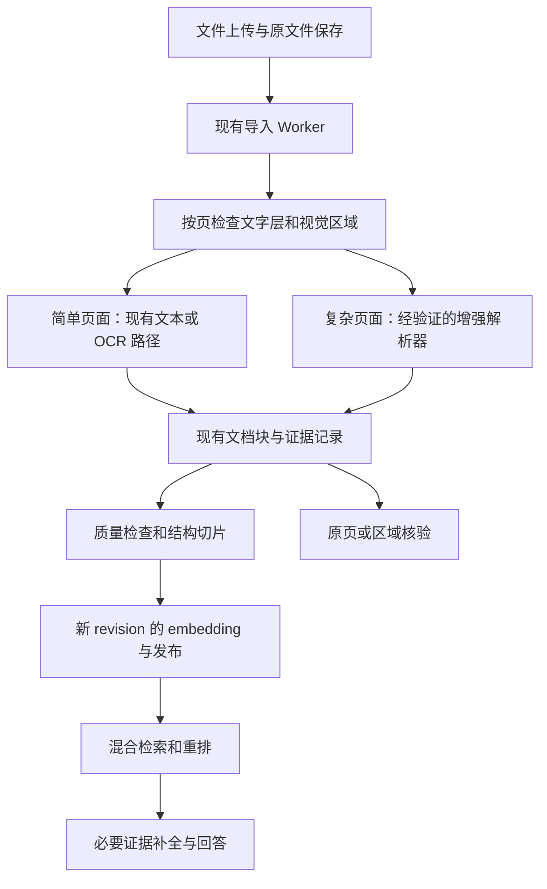

# PDF 与图片解析质量改进规划

日期：2026-09-18。状态更新（2026-09-23）：已完成十份样本的基线与 MinerU 对照、M2 结构接入、解析覆盖摘要与文档详情“部分识别”提示，以及部分 M3 隔离服务链验证。单页扫描件 RapidOCR 后验级联的效率开启条件未满足，`pdf_quality_cascade_enabled` 保持默认关闭；下一步按第 9 节实测并优化识别质量、速度和自动处理率。M0 扩展集、M2 上传队列提示/坐标定位、M3 发布验收仍未完成，未部署生产。历史阶段进度按其记录时间理解，当前决策以第 9 节为准。

## 阶段控制

- schema: sliver-stage/v2
- stage_id: pdf-understanding-improvement-plan
- primary_route: 开发执行
- delivery_kind: implementation
- task_depth: D2
- materialization_trigger: [cross_owner_drift, ordered_nonclosable_transition]
- risk_lanes: [resource_reliability]
- evidence_mode: test
- test_level: T1
- route_evidence_kind: null
- effect_class: none
- operational_mode: planned
- scope_authorization: confirmed: 用户授权执行主规划 9.4-9.7 的 P1 线程优化、P2 局部数字规整与 P3 扫描表格行列对应试验，每步交付后停下供验收。
- authorization_substage: P3-table-grid-alignment
- product_decision: not_required: 本轮仅优化已有 OCR 本地推理线程配置并在正式 OCR/PDF 解析入口完成独立数字空格规整与扫描表格行列对应对齐，不改变公共 API、数据模型或产品行为。
- active_substage: P3-table-grid-alignment
- result_status: completed: P3 成果明确如实定性为“扫描表格的文本行列排版试验”，暂不标为完整验收，不部署生产，不为了凑齐规划表述立刻扩写复杂表格代码：最终正文与切块完成文本行维度的行列网格排版改善与空单元格占位，跨列原文及不确定性提示显式保留且防重复（全文与切块严格仅出现 1 次），同时明确底层尚未生成 row/cell 级语义结构化解析单元；第 5 页经 200dpi 原图核正，位置对齐 32/32 行，文字逐字段完全正确 14 行，缺陷/不确定 18 行（包含 10 行输出漏前导负号‘-’误为 1层 的 Rows 2, 3, 8, 13, 16, 17, 18, 26, 28, 29，2 行错字二1层1号，3 行破折号，1 行跨列粘连，1 行面积严重错字 14863 原图确凿为 43.63，1 行印章遮盖）；纠正第 6 页姓名(禹健)、地址(红军大道君豪城市花园15-19幢)及末行文字；严格区分为“位置对应”、“文字识别正确”与“仍不确定项”；S3 耗时(最终版本实测预热中位数 8.2973s vs P2 6.7703s 并列说明，无逐页计时)与 4 文件单次内容回归验证完成，停步交回供审阅。
- truth_writeback: completed: 产物落盘于 scratch/parse_5_files_results_p3_final/ 与 p3_final_regression_summary.json。
- migration_state: not_applicable
- evidence_refs: [app/services/pdf_extract.py, app/services/ocr.py, .trellis/tasks/09-23-pdf-result-quality-review/sample-manifest.json, .trellis/tasks/09-23-pdf-result-quality-review/implement.md, tests/test_pdf_extract.py, tests/test_ocr.py, scratch/parse_5_files_results_p3_final/p3_final_regression_summary.json]

## 阶段目标与用户流程

目标：让公司常见 PDF 中可辨认的文字、数字尽量快、准确、自动地提取出来，保留页码、基本阅读顺序和必要的数字归属。直接调用现有 parse_import_file 及底层解析器比较；上传、排队、向量化、检索和生产 Worker 恢复均不纳入本轮耗时或实施范围。
用户流程：原文件直接输入 -> 预检 -> 本地 OCR / 文本解析 -> 结构化切块 -> 输出 JSON/MD 结果，优化推理速度并保持准确率。

## 当前真相与 Owner

当前核心推理入口为 `app/services/ocr.py`，负责 ONNX 推理会话及文字识别（Det, Cls, Rec）；`app/services/import_parsing.py` 与 `app/services/pdf_extract.py` 负责文档导入与页面图片切块。现有实现中 `rapidocr-onnxruntime=1.2.3` 未将应用层线程参数下发至 `onnxruntime=1.27.0` 会话。

## 调研决策

- research_status: completed: 已实测确认 RapidOCR 1.2.3 线程参数未下发至 ONNX 会话（默认 0），并在 S1 最慢图片上验证 intra_4_inter_1 延迟降低 33%（中位数 4.39s vs 6.59s）。

## 范围与非目标

范围涵盖 P1 本地 OCR 线程适配优化、P2 局部独立数字 OCR 块空格规整，以及 P3 常见扫描表格行列网格对齐，与 5 份原文件的全量直接解析回归。非目标：不修改上传接口、Worker 队列、数据库或全局开关；不更换模型；不引入复杂通用版面分析大模型；不发布生产。

- 收益定性与边界：P1 线程适配优化稳定保留（同机同条件 S1 预热中位耗时降幅超波动）；P2 验收通过严格限于 S3 16 处独立数字空格规整；P3 成果如实定性为“扫描表格的文本行列排版试验”，暂不标为完整验收，严格区分为三类：（1）排版改善（网格线聚类对齐、空单元格占位、坐标缺失/无效/空结果零正文丢失保底；收起自动补表头逻辑避免误伤普通数据行；明确底层尚未生成 row/cell 级结构化单元）；（2）已证实的行列对应（无跨列粘连、物理线框明确对应的数据行，未逐字段核对者仅标位置已排对；第 5 页位置排对 32/32 行，逐字段完全正确恰好 14 行）；（3）仍不确定项（删去字符中位数与框宽比例强制切分规则，Page 5 第 1 行跨列证号与面积在最终切块与正文中保留原字符串 20140062969.59、原图位置 [667, 243, 934, 286] 与明确的跨第4-5列不确定归属，相邻列采用简短提示 [跨列不确定: 参见第4列]，原字符串严格仅出现 1 次；Row 02/03/08/13/16/17/18/26/28/29 输出漏前导负号、Row 05与Row 25门牌号“二1层1号”为OCR错字不计入文字正确；Row 29 面积 43:64、Row 30 面积 14863(原图确为43.63)、Row 32 及 Page 6 Row 14 盖章遮盖字等明确列为未解决）。清理旧结论，停步交回供审阅，暂不发布生产。

## 子阶段计划

| 子阶段 | 结果 | owner | 完成标准 | 验证 | 不触碰 |
| --- | --- | --- | --- | --- | --- |
| P1-ocr-threads-optimization | completed (验收通过) | app/services/ocr.py | 解决 RapidOCR 1.2.3 线程适配，同机同样本 S1 预热中位耗时降幅超过波动，5 文件内容无退步 | scripts/profile_pdf_pipeline.py 与 pytest 验证 | 生产 Worker、数据库、外部 API、全局开关、site-packages |
| P2-local-ocr-refinement | completed (验收通过) | app/services/ocr.py | 独立数字 OCR 块点后空格规整（严格限于 S3 改善 16 处，S1 截图错字与 S2 远景小字仍待解决），单测与 5 文件回归零退步 | 负向用例单测与 5 文件全量回归 | 生产 Worker、数据库、全局开关 |
| P3-table-grid-alignment | completed (文本排版试验待审阅) | app/services/pdf_extract.py | 扫描表格文本行列排版试验：正文与切块网格排版改善、跨列原文与不确定提示保留且防重复，明确尚未生成 row/cell 结构化单元，严密三分类定性（14 行完全正确，18 行缺陷/不确定） | 针对性单测 (56 pass)、S3 专项同入口基准(8.2973s vs 6.7703s)与 4 文件单次回归 | 生产 Worker、数据库、全局开关 |

## 测试、安全与影响

修改前运行 GitNexus upstream impact 分析（`_get_engine` 风险 HIGH）；OCR 入口共享锁保留，不直接修改 site-packages，避免多线程内存或上下文冲突。

## 验证方法

在同一机器、同一批文件下分别执行冷启动与 3 次预热运行，核对耗时中位数、字符数、页码数及单元格结构一致性。

## 停止条件与未验证

若 intra_op 调整无法带来稳定性能收益或导致精度回退，保留原配置并如实报告。MinerU 生产指标严格标为未验证。

## 1. 目标与判断

让复杂 PDF 的原始信息、结构和证据位置可靠进入知识库，使系统能正确召回、组合回答，并对看不清、没有依据的部分明确说明。

第一期聚焦 PDF 和独立图片，优先处理分栏、表格数字、公式与选项对应。沿用 FastAPI、现有导入 Worker、文档版本/证据体系、bge-m3、Qdrant 和当前混合检索，不重建一套 RAG。视频放在 PDF 和图片链路稳定后单独设计。

执行顺序是：固定回归集 → 候选解析器对照 → 结构化结果接入与切片 → 检索/回答验收 → 小范围上线。当前沿用 MinerU 3.4.4 作为隔离增强实现，不扩大引擎数量；先补覆盖提示、来源定位和上线验收。鉴于用户首要问题是扫描件、图片识别失败与遗漏，将 M4 的图像专项评测提前到 M2 收尾之后，但图像结果未经独立验收不进入回答证据。

### 已确认的现状

- 9 月 17 日的 10 个原文件与上传记录 SHA-256 全部匹配，均为单页图片 PDF。7 份解析成功，3 份无文字图形/照片未形成切片。
- 成功文档共 15 个切片，15 个有效的 1024 维向量，文本与版本一致。切片覆盖了已解析正文，但 OCR 本身有错漏和串列。
- 18 次生产服务链路测试包含 13 个不同问题。课件问答、报纸四片组合、教材两片组合可用；表格题在批次和全库查询中均因数字错误答成 1/4，正确结果为 5/11。
- 选项对应丢失导致“5/17 算对、选项 C 说成 D”；流程图关系被误解；一条拒答解释把零散数字及页码拼成了不存在的比较题。
- 现有 [基础 OCR 计划](../23-pdf-image-ocr-plan.md)明确不恢复表格行列和版面关系。本规划是质量能力的下一阶段，不能把基础 OCR 已实施等同复杂文档已支持。
- 本地 `build_pdf_source` 仍将页面正文交给文本切片器，同时保存 OCR 区域；`DocumentBlock` 已有父块、类型、位置、内容、解析器版本等字段。同步上传与异步 Worker 共同调用 `build_pdf_import_source`、使用 `ocr_image_blocks` 并透传 `segments`，解析器选择、OCR block、page/location、parser unit 和 coverage/routing 来源由同一入口生成；真实 HTTP/UI 与 Worker 双入口仍需按固定样本验收。
- 9 月 18 日已核验并调用 MinerU 3.4.4 服务，新增 `app/services/mineru_pdf.py` 适配器，经服务地址和测试库 slug 双条件启用；默认路径仍是 RapidOCR。仅接收文字、列表、表格和公式，图像生成描述不进入正文和向量。服务容量与正式部署许可仍需完成上线核验。

### 9 月 18 日隔离验证增量

- 四份文档形成 25 个切片及 25 个真实的 1024 维向量，版本、正文和证据标识一致；其余六份图像类文件明确拒绝，不计为识别成功。
- 表格 `5/11`、硬币 `C、5/17`、课件七项特质、报纸组合、跨题比较各三轮核心结果正确。共 28 次检索，20 次生成回答，8 次无证据跳过生成。
- 接入初版曾生成 59 片，英文列表丢失引导语导致漏召回；现按预算聚合同页连续正文和列表，保留子块位置，修复了该回归。切片数变少本身不是质量指标。
- 答案仍有多余解释和不相关论据，不能把“结论正确”等同“每句话都有依据”。全库干扰、HTTP/UI 上传、混合图文覆盖状态、定位变换与回滚尚未验收。
- [本轮报告](../../output/pdf-understanding-eval-20260918/m2-isolated-prose/report.md)记录实际范围及限制；132 项聚焦测试通过。测试库不含生产其他文档，不能当作生产全库验收。

实测依据：[完整审查](../../output/pdf-review-20260917/report.md)、[逐题证据](../../output/pdf-review-20260917/rag-review.html)、[原始结果](../../output/pdf-review-20260917/rag-results.json)。这些是本地评估产物，不应把原始业务文件或完整正文随规划提交到公共仓库。

## 2. 别人的做法，以及我们借鉴什么

以下是官方描述的能力，不代表在这 10 个文件上已经验证有效。资料查阅日期为 2026-09-18，实施时记录所选版本、模型及配置，避免直接套用不同版本的接口。

| 方案 | 官方做法 | 对本项目的用途 |
|---|---|---|
| MinerU | 输出有顺序的语义块、结构化 JSON 和相关图片资源；输出契约有版本区别 | 优先核验现有服务，作为增强解析的首个对照候选；读取结构化结果，不能只取 Markdown 再扔掉结构。[官方输出契约](https://opendatalab.github.io/MinerU/reference/output_files/) |
| PP-StructureV3 | 将版面、表格、公式、多栏阅读顺序等放入文档解析流程，结果包含区域位置和块顺序 | 作为表格/公式/中文复杂版面候选；与普通 OCR 行文本的能力分开评价。[官方文档](https://www.paddleocr.ai/main/en/version3.x/pipeline_usage/PP-StructureV3.html) |
| Docling | 用统一文档对象保留文本、表格、图片、层级、位置和来源；按层级切分，再按 token 预算拆并，长表可重复表头 | 借鉴中间结果和切片策略。只有前两个候选在资源或质量上不合适时，再增加运行对照，首轮不同时部署三个引擎。[文档对象](https://docling-project.github.io/docling/concepts/docling_document/)；[切片](https://docling-project.github.io/docling/concepts/chunking/) |
| ColPali / ColQwen 类视觉检索 | 将页面视觉内容编码成多向量用于文档检索 | 后续解决“图片内容找不到”的候选路径；找到页面不等于正确计数、读表或回答，不纳入第一期主链路。[官方项目](https://github.com/illuin-tech/colpali) |
| OmniDocBench | 分别评价文本、表格、公式和阅读顺序等维度 | 借鉴分项验收，避免把字符数量、成功文件数或总体榜单当作实际答案准确率。[官方项目](https://github.com/opendatalab/OmniDocBench) |

共同启发：保留结构和来源，分项评价，再验证 RAG。我们复用已有 block/evidence 模型，不因引入一个解析器就额外建设通用调度平台或新的资产数据库。

## 3. 每类问题怎么修

### 3.1 分栏和阅读顺序

先识别栏、标题、正文、表格、公式、图片等区域，再按语义顺序组装。多栏页面不能按全页纵坐标逐行拼接；栏间标题、跨栏表格必须单独处理。

对报纸区分不同公告；对教材区分题干、题号、选项和附图。不要用强制“从左到右”规则覆盖所有布局，采用解析器输出并用真实样本核验。

验收：三栏公告的各段不互相穿插；教材第 1 题不混入第 5 题；页码 416 不成为公式的一部分。

### 3.2 表格数字与行列关系

保留表头、行列索引、合并单元格、单位和区域位置。规范文本只是结构化表格的可读投影，例如：

```text
Birthday Money
面额 | 张数
$5  | 5
$10 | 3
$20 | 2
$50 | 1
```

对关键数字区域，出现低置信度、结构冲突、行列无法对齐时，触发局部高分辨率重新识别或独立复核；保存冲突，不静默用模型“润色”成一个确定值。简单格式检查抓不住“1→10”这种同样合法的数值，两个识别器结果相同也不是正确性证明。

清晰、可核验的原图及人工标注是验收依据。未能解决的关键单元格应标为不确定，回答时不根据它给出确定计算结果；不能因为表格有四行或重排分高就标为可信。

### 3.3 公式、选项和题块

分数用 LaTeX 或等价的无歧义文本保存，连同题号、关系符号和选项标签组成题块。保留 `C: 5/17`，不能存为彼此脱离的 `C`、`5`、`17`。

题干、短选项、对应小表格优先整体切片。长题块需要拆分时，每片保留题号及必要上下文。无法识别选项标签时，系统可在证据足够时给出数值，但不得自动补选项字母。

### 3.4 低清图片与无文字图像

质量检查同时看源图尺寸、有效区域大小、模糊情况与识别结果，不能只以文字数判断。191×51、195×102 的源图即使放大渲染，也无法恢复不存在的细节。

- 低清汉字：优先原始嵌入图或清晰源文件；定位到目标区域再识别。仍不可读时明确标注未识别区域。
- 拼音连线：文字识别和连线端点关系是两项能力，分别验证；不能根据拼音常识代替读图。
- 方格计数：需要图形理解与计数验证；局部视觉模型也可能数错，不承诺接入后自动正确。
- 照片：可生成用于检索的客观描述，人物意图、身份等无依据内容不生成。
- 流程图：需要方向及连接关系，不能用关键词列表代替。视觉描述、关系推断与逐字识别区分来源。

第一期先让状态和覆盖范围诚实；图像语义增强作为后续独立阶段。图片识别为空不能伪装成“入库完成、可问答”。

提前开展图像专项评测：分别测清晰图片文字、低清文字、流程关系、连线关系、方格计数、照片描述，不把它们归为一个“视觉识别成功率”。先选一个具体问题验证现有能力；只有该类失败原因明确、现有能力不满足时才增加一个候选。原六份失败文件用于回归，另留未参与调参的样本用于验收。生成描述通过后也须标明派生来源，并与逐字识别分开；未达标继续显示未覆盖。

### 3.5 切片、召回和回答

- 切片先尊重标题、段落、题块、表格，再按 embedding 的实际 token 预算控制长度；不能把现在的字符长度配置直接当作模型 token 数。
- 小表整体保存；大表按行组拆分并重复表头、单位及表名，保留来源单元格；超宽行须明确处理，不无声截断。
- 引用需要的标题/表头可以补入检索上下文，但必须区分原文和派生上下文，不能为补充文字伪造原文偏移。
- 当证据确实跨片时，再按同一库、文档、版本和父块取必要片段，受上下文预算约束，避免无条件拼上前后页。
- 用户选定文件或提供明确文件名时，先在有权限的文档范围解析目标；匹配歧义时澄清。目标解析失败就说明状态，不能因为文件名相似换成另一个文档作答。页码、行位置的问题需要结构定位，不能只靠正文语义相似度。
- 保持现有检索参数作为基线，先修输入结构。重排分评价相关性，不评价数字是否识别正确。
- 回答只引用有支持关系的证据；资料不足时简短拒答，避免拒答说明里再拼造事实。提示词作为补充措施，不能替代结构化解析和原图核验。
- 将“答案结论”和“所用论据”分开验收：比较 `5/17` 与 `2/5` 时，不得拿另一题的 `1/4 < 2/5` 当证明；原文只有七项标签时，不补充未写明的逐项解释。先以真实失败用例约束现有回答逻辑，不预设再加一个审查模型。
- 同页短列表必须保留引导语；长列表需要有界地携带主题上下文。扩展集同时检查合并是否跨越不同题目、公告和章节，不把本批成功的合并规则当作所有文档通用规律。

## 4. 在现有工程中的落点



页面上文字多，不代表内嵌图片没有重要内容。路由需结合布局/视觉区域覆盖；不能继续只用 `text_chars < 20` 决定是否需要增强。先在测试库显式指定增强解析验证，质量通过后再增加自动路由，避免先构建复杂 Analyzer/Plan 框架。

### 责任划分

| 现有位置 | 拟承担工作 | 边界 |
|---|---|---|
| `app/services/pdf_extract.py`、`import_parsing.py` | 页面分析、候选解析器结果映射、结构保留 | 同步和异步入口使用共同逻辑，避免只修一种上传方式 |
| 现有 parser units / `document_blocks` | 存储块层级、内容、位置、解析来源 | 先复用 `content`、`position` 等字段；必要字段迁移单独评审，不另造平行模型 |
| `app/services/splitter.py` | 按题块/段落/表格产生切片 | 不把所有格式的切片行为一起改动 |
| 现有 revision、embedding、发布链路 | 生成新版本并校验点/片一致性 | PostgreSQL 与 Qdrant 不是跨库原子事务，沿用可见性与清理机制 |
| `app/services/retrieval.py`、`chat_answer.py`及文件定位入口 | 有界证据补全、来源明确、答案约束 | 不借此替换当前 embedding 或问答模型 |
| 文档详情与导入状态 UI | 显示部分识别、未覆盖页、可查看原图 | 质量状态与作业执行状态分开，不直接滥加 job 状态枚举 |

解析结果最低要求：文件哈希、文档/版本身份、页码、块类型、父块与顺序、原始识别文本、结构化内容、解析器及模型版本、质量标记、来源位置。缺失置信度时记录未知，不补成 1.0。

位置必须记录坐标单位、原页尺寸、旋转和裁剪变换；引擎的 0 基页码统一映射到产品页码。正常抽样需能从引用准确打开原页/区域。混合文字与 OCR 应按区域去重，不能整段直接相加。

视觉生成的描述标明派生来源，不把它伪装成逐字 OCR，也不伪造与规范正文不一致的 source ranges。图像裁剪优先使用已有文件存储与版本关联，禁止把图片字节塞进 Qdrant payload。

## 5. 实施阶段及停止条件

| 阶段 | 工作内容 | 交付与退出条件 |
|---|---|---|
| M0：固定基线 | 整理这 10 份文件、13 个问题、关键事实人工标注；固定源哈希、模型、镜像和配置；补原生/混合/旋转/多页样本 | 可重复运行的评估清单；区分无证据和错误答案；记录额外样本来源。原始图片重制为 PDF 的样本不冒充官方完整基准 |
| M1：候选对照 | 首先核验既有 MinerU 服务，用隔离输出评估原图、结构结果和耗时；以当前 RapidOCR 为基线，按需要增加 PP-StructureV3；只有质量或运行约束不满足才扩大候选 | 给出逐项胜负、失败样本、CPU/RAM/显存、冷启动/稳态耗时及版本；明确选一个增强实现或报告未通过，不直接改生产 |
| M2：结构接入 | 把胜出方案结果映射到现有 block/evidence；先修表格、题块、阅读顺序；验证两种导入入口、质量提示和原图定位 | 关键事实正确、切片不破坏关系、结构与引用可核验；原生文字和正常课件无回归 |
| M3：RAG 与小范围发布 | 在测试库重建切片/向量，固定问答模型复跑；再验证文件定位、跨片、权限和版本可见性；通过后小批灰度 | 满足下表验收、故障/回滚演练通过。回滚路径、资源预算未验证时不放量 |
| M4：视觉理解 | 从流程图、连线、方格、照片的固定样本开始，只对目标区域调用视觉模型 | 单独给出识别/关系/计数与拒答结果；标清派生描述。未达标保留“未覆盖”，不包装为已解决 |
| M5：后续多媒体 | 视频采用转录、时间戳、镜头/关键帧与去重，再复用图片和证据链路 | 单独规划时间定位、同步、资源成本；本轮不实现视频与多向量检索 |

当前阶段进度：

| 阶段 | 已验证 | 未完成 |
|---|---|---|
| M0 | 十份源文件哈希、原问题和关键事实基线 | 30–50 页独立扩展集及其标注 |
| M1 | MinerU 3.4.4 真实调用与候选结果对照 | 正式容量、许可和部署适用性核验 |
| M2 | 结构适配、题表切片、列表上下文、来源块透传；`pdf-coverage-v1` 覆盖摘要随结构块持久化，目录详情区分完整/部分/未知；同步与异步入口统一结构化 OCR；确定性 PDF 预检和 `pdf-routing-v1` 路由来源已接入共同入口 | 真实双入口上传、上传队列覆盖提示、页尺寸/旋转/坐标定位、正常文档扩展回归；旧 revision 需重解析后才有覆盖与路由摘要 |
| M3 | 隔离库真实 embedding/发布、28 次检索与核心问答复测 | 全库干扰、逐项论据、权限/删除/旧版本、故障回滚、小批发布 |
| M4 | 已发现图像描述不可靠，当前排除出证据 | 提前做分类型专项评测，再决定是否接入 |
| M5 | 未实施 | 视频继续后置 |

不按阶段数量估算完成百分比。M2 收尾与 M4 小规模图像评测优先；M3 上线门槛保持不变。现有 bge-m3、Qdrant、Worker 和回答模型继续作为基线；没有证据支持现在换掉整套技术栈或同时部署多个新解析器。

## 6. 验收标准：从源图一直查到答案

| 层面 | 必须核对的内容 | 本批明确验收点 |
|---|---|---|
| 识别 | 数字、文字、分数和符号对照原图 | 表格 $50=1；关键汉字不能把错字当正确；无法辨认要明确 |
| 结构 | 单元格、选项、栏序和父块关系 | `C=5/17`；各公告不串列；页码不混入公式 |
| 切片 | 必需上下文是否保留、长度是否超预算 | 表头与行同片或可准确补全；题干与选项不失联；新切片数量允许改变，不要求继续为 15 |
| 向量 | 应发布的片都有点，正文/版本一致且逻辑可见 | 维度与模型匹配、无空/非法向量；旧版本与已删除文档不被返回 |
| 召回 | 应有的证据是否全部进入回答上下文 | 两片组合与报纸多片组合继续通过；同时测试本批范围和全库 |
| 回答 | 事实正确、计算正确、引用能支持结论 | 表格必须答 5/11；硬币结果 5/17，若有选项必须是 C；不存在的指标/后续规划不补造 |
| 拒答 | 无证据时是否明确、是否附带编造 | 不生成“2/3 与 4/16 比较题”；图像未覆盖不借相似文件硬答 |
| 展示 | 状态和证据是否真实 | 区分已保存、可检索、部分识别、视觉未覆盖和解析异常；原图位置正确 |

提议的发布门槛：本批明确数字/选项回归点全部通过，当前正确课件与跨片题不退步；每个关键问答至少重复 3 次并逐条检查，不用一次碰巧正确作为通过。无法覆盖的图像样本必须有清晰状态及合理拒答，不能据此计为识别成功。

扩展 30–50 页独立样本，包含未用于调参的验证页：原生文字、混合内容、多栏、跨页表格、公式、旋转、低清与空白页。分别报告正确率、拒答率、覆盖率、证据齐全率和耗时；不只汇总一个数字。具备配套标注时可增加文字编辑距离、表格 TEDS、阅读顺序指标，不能仅凭文件名套用 OmniDocBench 标准答案。

## 7. 重解析、资源与回滚

- 先独立测试库和白名单样本，保留原文件。候选解析未通过时不能覆盖当前可用 revision。
- 解析器变化使正文/切片变化时，创建新的版本并重新 embedding，完成校验后通过现有发布路径切换。禁止只更新正文而继续使用旧向量。
- 旧版本按既有保留/删除策略处理。关闭增强开关只影响后续任务，不自动恢复已经重解析的文档；真正回滚需验证旧版本仍在并能重新发布，或者用锁定的旧解析配置从原文件重建。
- 重试与重复投递不能产生多个可见版本；文档删除、撤销权限、清理期间仍遵守现有可见性过滤。裁剪图及增强结果同样继承库/文档权限，不能成为绕过授权的静态链接。
- 记录页数、渲染像素、超时、并发、队列等待、内存/显存峰值和临时文件大小；长文档设置页级检查点或有界批次，具体沿用 Worker 能力。只有证实需要独立重试/调度时才拆任务，不预先设计六种队列。
- 增强引擎失败不静默回落后显示“完整成功”；保留可用的旧版本或明确本次质量降级。保留原有损坏文件、渲染资源上限等保护。
- 候选需核对实际安装版本、模型权重、服务接口和适用许可；部署方式及商业使用条件未核实前不作为正式生产选型。第一轮评估优先本地服务，不为比较解析效果默认引入外部文件上传。

## 8. 下一步的具体执行单

后续实施不重做已通过的候选对照，按以下顺序补齐：

1. **M2 覆盖提示第一切片已本地完成，继续补上传状态。** 当前保存已处理页、未覆盖视觉页、跳过视觉块数量和受限原因；有正文但重要图像未处理时，知识目录详情显示“部分识别”，旧文档或无法量化时显示“覆盖未知”，不输出虚假百分比。下一步把同一摘要安全投影到上传队列，并补真实双入口验收；作业完成不等于内容完整。
2. **M2 收尾：上传和引用可核验。** 实测同步、异步上传，分别核对来源块；补齐页尺寸/旋转/坐标变换后检查原页定位。文件名明确但目标未解析成功时显示该文件状态，不换相似文件回答。
3. **M4 提前评测：针对六份失败样本补能力。** 先分别确定“文字看不清”还是“关系/数量看不懂”，从扫描件和图片文字遗漏入手，再测流程关系和计数。验收前不放开图像描述入库；记录覆盖改善与错答，拒答不能记为识别成功。
4. **M3 答案与回归：检查每项依据。** 保留现有模型和检索基线，增加多余解释、跨题论据、明确文件名与相似文件干扰的回归。核心题仍各测三轮，结论、论据、引用分别评分。
5. **M0/M3 扩展与发布门槛。** 完成 30–50 页独立样本、长文档/旋转/跨页表格、并发与故障测试；验证旧版本、删除/权限过滤和回滚，再小批启用。不直接批量重建生产知识库。

本轮不增加依赖、不更换模型、不扩大生产启用范围。覆盖信息和“部分识别”已完成本地第一切片；确定性预检与白名单路由只改变已授权库中新导入 PDF 的解析选择，后续继续补上传队列投影、真实双入口验收和隔离图像专项评测。

### 9 月 18 日 M2 覆盖状态实施回写

- 新增版本化 `pdf-coverage-v1` 摘要。MinerU 对跳过的图片、流程图等视觉块记录页码、数量和受限原因；RapidOCR 路径对已知含视觉但未 OCR 的页面记录部分覆盖。只有调用方提供经有界核验的总页数且全部相关块都可核验时才标记完整；远端 `middle_json` 在坐标专项完成前不展开，覆盖状态保持部分或未知。
- 覆盖摘要作为非正文的专用 parser unit 写入现有 `DocumentBlock.content`，不新增迁移、不改变导入作业状态，也不进入 chunk 或向量正文。目录详情接口按当前库、文档和 revision 读取；坏数据和旧 revision 均安全投影为“覆盖未知”。
- 管理后台知识目录详情新增完整识别、部分识别和覆盖未知提示，展示已知未覆盖页和跳过视觉块数量，不展示百分比；该区域只对 MIME 明确为 PDF，或 MIME 缺失但扩展名为 `.pdf` 的文件显示。上传队列尚未接入该摘要。
- 固定十份评测原件位于 `D:\Program Files (x86)\OmniDocBench_images_to_pdf`，文件名、大小和 SHA-256 以 `output/pdf-understanding-eval-20260918/m0-manifest.json` 为准。部署测试库“部署测试3”（`library_ylmwbkwxssfs`）已有对应文档和 RapidOCR 基线，但只用于只读辅助核对，不作为固定输入，也不回写本轮 OCR 结果。
- OCRPlane 隔离评测通过 `https://ocr.rhzy.ai` 的 MinerU `hybrid-auto-engine` 完成十份同步任务，原始结果和无凭据清单位于 `output/pdf-understanding-eval-20260918/ocrplane-mineru-auto/`。人工判定为通过 2 份、部分通过 2 份、失败 5 份、明确幻觉 1 份；API `completed` 不代表内容识别成功。`unlimited-ocr-vllm` 哨兵因后端连接失败未进入十份质量排名。2026-09-20 对 `10.0.10.2` 的只读核查已定位直接原因：`10001` FastAPI 代理仍在线，但它依赖的 `127.0.0.1:10000` SGLang/Unlimited-OCR 模型服务没有监听且无对应进程；恢复模型服务并通过哨兵前不得把该 provider 计入质量排名。
- 本地验证：此前 PDF/MinerU、同步上传、RapidOCR 和图片导入聚焦回归 `144 passed`，覆盖持久化、目录、目录 API 与公开 API 聚焦回归 `49 passed`；本次资源边界收尾重跑后端定向测试 `68 passed`、同步/异步导入与目录相关测试 `103 passed`，目录前端 `26 passed`。仅有既有 Starlette/httpx 与 HTTP 422 弃用警告。
- 解析资源边界同步收紧：MinerU 响应硬上限 64 MiB，`content_list` 逐项解析，并在 JSON 解码前限制嵌套深度和结构节点数，同时限制页数、内容项、累计字符串、表格展开文本和结构单元；RapidOCR PDF 路径限制累计正文和 OCR block，在规范化前检查单次 OCR 输出，并把 OCR 异常转为不泄露内部信息的固定错误。OCR 关闭时不读取嵌入图片字节；OCR 开启时优先用可用流长度元数据在访问图片数据前执行预算检查，同页多图仅部分得到有效文字时保留成功正文但将该页标为视觉未完全覆盖。
- 未完成：旧文档重解析、真实 HTTP/UI 与 Worker 双入口验收、页尺寸/旋转/裁剪坐标转换、原图框选、30–50 页扩展集、全库干扰、权限/删除/旧版本和故障回滚验收，以及生产部署。

### 9 月 20 日确定性解析策略实施回写

- 明确不采用 Laya、Jev 或 LLM 分类器。借鉴 Unstructured 的 `auto/fast/hi_res/ocr_only` 与 Marker 的 `fast/balanced` 显式档位，以有界事实预检代替学习型路由；PaddleOCR 的版面分析流水线仅作为能力分解参考，MinerU 继续提供结构化增强结果，本项目额外执行 fail-closed 覆盖门禁。
- V1 采用文档级单一主解析器。预检只读取页数、文字层和图片/XObject 元数据，不解码图片、不渲染页面、不调用 OCR，也不声称识别表格、公式、多栏或流程图。配置和知识库 slug 白名单仍是 MinerU 的硬授权边界；预检未知、损坏或资源超限不触发远端解析。
- 解析选择和有限原因写入空文本的 `pdf-routing-v1` structured unit，不进入正文、chunk 或向量；`needs_review` 是质量信号，不是导入作业状态。MinerU 请求、版本或响应校验失败继续显式报错，不静默回落后宣称完整。
- 页级或区域级跨引擎组合暂不实施。只有坐标体系、重复内容消解、来源映射和 30–50 页独立验证集均通过后再单独评审；V1 不拼接 RapidOCR 与 MinerU 的 Markdown 或正文结果。
- PP-StructureV3 保留为隔离对照候选，不安装到 API/Worker 主环境，不与本轮主链路共享模型依赖。模型权重、服务容量和许可在任何部署决定前单独审核。
- 本轮 coverage 与离线回归收尾：`build_pdf_import_source` 将有界完整预检事实传给本地 PDF 解析与 MinerU 远端调用；只有总页数已知、所有页面均产出解析单元且无未处理视觉页时才标记 `complete`。没有预检证据时保留 `unknown`，存在未处理视觉页时保留 `partial`。针对代码审查发现的边界问题完成针对性加固：`_page_count_hint` 防御捕获页树异常（避免损坏 PDF 逃逸为 500）；路由原因完整映射 `resource_limit`；`total_pages` 透传至 MinerU，使合规 MinerU 文档能够获得 `complete` 覆盖。后端定向及聚焦回归扩展集全部通过（276 passed），前端目录控制台全部通过（26 passed），针对本任务文件 compileall 与 Ruff 检查通过；十份固定样本离线预检（2.6ms ~ 282.8ms）与确定性路由决策全部符合预期（非白名单保守回落、白名单按规则增强、生成式图像描述过滤防止幻觉、低清文件标记部分覆盖）。真实 HTTP/UI 与 Worker 双入口全链路联调、远程 Provider 在线联调和 30–50 页独立扩展集仍待验证。

## 9. 2026-09-23 本地原文件解析优化规划（当前执行入口）

**当前状态：规划已修订，优化尚未实施。** 用户随后明确先直接识别本地原文件，验收识别速度与质量。下一步执行 **9.4–9.7**；9.1–9.3 保留为此前生产试跑安排的历史记录，不再作为本轮前置条件。生产 PDF 自动消费阻塞另行处理，不阻塞本地解析优化。本机记录见 [Trellis 任务](../../.trellis/tasks/09-23-pdf-result-quality-review/)。本次只写规划，不修改解析代码、依赖或生产环境。

### 9.1 历史记录：首轮文字识别目标

目标是让 PDF 中**人眼能看清的文字和数字**尽量准确、尽量快地进入可检索文本，保留页码和普通文档的基本阅读顺序。首轮重点是公司常见的图片型 PDF、扫描文档和普通文档；其中可辨的图片文字也应提取。没有可辨文字的图片页可以没有正文，但不能凭空编字。表格出现时如实核对数字是否串行；复杂分栏和表格还原不是首轮主要优化目标。首版不做照片描述、图表含义、方格计数、印章理解或完整业务字段抽取。

以实际导入耗时、关键文字/数字错误、顺序/表格串行、无需人工完成的文件数共同判断效果；不能靠多拒绝文件或多转人工制造“高准确率”。人工只用于这批样本的一次性核对、少量抽检和确实看不清的例外，不让用户逐页校对日常文件。

当前证据：[Q0 返工清单](pdf-q0-ground-truth-review-20260923.zh-CN.md)仍需修正路径、发票 0.01 元票面差异与“无法判断”统计口径后验收；10 份基准与 21 份探索样本都为单页，不能代表所有长文档。[既有本地计时](../../output/pdf-cascade-eval-20260922/stage_timing_report.json)不是完整导入耗时；当前 MinerU 实际质量和速度仍为**未验证**。后验级联继续关闭，不以放宽阈值换取通过数。

### 9.2 历史记录：生产环境小范围试跑安排

1. **先收好 Q0。** 修正已发现的记录问题，保留 10 页可确认文字、数字和“无法确认”项；这只是测试答案准备，不建设人工标注产品流程。
2. **最小实现。** 优先复用现有原生文字、RapidOCR、已授权 MinerU 及共同 PDF 导入入口。先检查当前代码能否给出可读正文；只有实测发现的明确故障才做最小修复。首轮不安装一组新解析器、不加复杂调度/风险摘要、不切换生产模型。若现有链路已经满足，不为“做一版”重复写代码。
3. **生产环境小范围试跑。** 用户已明确选择生产环境。执行前先只读核对当前版本、目标库/权限、Worker 与 MinerU 可用性，并确定一个**生产环境内的专用测试库或明确隔离的测试文档范围**，写清失败时停止与恢复步骤。先从已有材料选 5–8 份原 PDF，**多数选图片型 PDF、扫描文档和普通文档**，涵盖清晰印刷、较模糊文字及有图有字的常见情况；可放 1 份原生文字 PDF 作对照，复杂分栏或表格页只作边界观察，不用其主导首轮改造。经真实上传、同步或异步 Worker 导入、存储文本、切片及检索走完整路径；核对原页与最终可检索文字，记录每份成功/失败、关键漏字错字、数字、页序、总耗时与人工介入，遇表格再记录数值是否串行。样本试跑不触发全库重建或其他用户文件重解析；成功后再决定是否用手头其余样本扩大观察，不要求用户现在提供新材料。
4. **交一次结果，再决定第二轮。** 交逐文件对照和最明显的一个瓶颈/错误；若首版不够准或太慢，再根据实测选择局部修复或**一个**大模型识字候选。大模型只用于识字对照或困难文字区域，不预设比人或现有 OCR 更准；无像素依据的文字必须保持不确定。第二轮方案交验收后实施，不在首轮铺开多模型平台。

首轮交付至少包含原文件哈希、所用解析器/版本、最终入库文字与原页关键文字对照、完整导入耗时、自动完成/失败情况，以及失败时原文件和旧 revision 的状态。不得用 OCR 字符数、API `completed` 或历史 MinerU 输出替代真实结果。清晰普通文档不能退步；数字错了或遇到表格串行要如实报告，不强行写“通过”。

### 9.3 历史记录：生产试跑边界

用户已授权以生产环境作为首轮试跑目标；授权范围是**受控样本的实际导入与核验**，不等于批准全局部署新模型、开启门禁、向新增外部模型发送业务 PDF、购买/下载模型或批量重解析。执行前先交付可审阅的实际改动、目标库/样本清单、权限与影响范围、停止条件和恢复步骤；若需要改生产服务版本，先完成本地验证并明确发布与回退方案，再按该具体变更执行。任何代码修改先按 `AGENTS.md` 做 GitNexus impact 与针对性测试。保持 `pdf_quality_cascade_enabled=False`、MinerU 双重授权、资源上限和旧可用 revision。文档改动运行 `git diff --check`，代码完成后跑受影响的 PDF/导入回归。

如果生产环境目标库、服务或恢复条件不具备，明确写“未验证”和阻碍原因，先完成本地可运行部分，不能把隔离脚本计时冒充真实上传。首轮只报告这批单页样本在**该生产环境受控范围**内的效果；长文档泛化、全库速度/准确率与全面发布就绪仍未验证。

### 9.4 当前目标与已核验基线

目标：让公司常见 PDF 中可辨认的文字、数字尽量快、准确、自动地提取出来，保留页码、基本阅读顺序和必要的数字归属。用同一批原文件直接调用现有 `parse_import_file` 及底层解析器比较；上传、排队、向量化、检索和生产 Worker 恢复均不纳入本轮耗时或实施范围。

原文件绝对路径、SHA-256、完整文本及结构化输出位置统一保存在[本机样本清单](../../.trellis/tasks/09-23-pdf-result-quality-review/sample-manifest.json)。可提交规划仅使用样本编号，不复制业务正文、证号或个人信息。清单中的文件为用户提供的 5 份原文件，不能用库内历史结果替代。

| 样本 | 内容规模 | 既有单次纯解析耗时 | 已核验事实与限制 |
| --- | --- | --- | --- |
| S1 | 45 页混合 PDF | 83.8952 秒 | 输出覆盖页码 1–45；32 页原生模式、12 页混合模式、1 页视觉未覆盖标记。12 页共有 28 张不同图片；截图和照片仍有错漏。页码齐全不等于内容全对。 |
| S2 | 1 页照片 PDF | 2.7047 秒 | 有正文输出；招牌、小字、时间等存在错漏。 |
| S3 | 6 页扫描权证 | 17.2115 秒 | 输出覆盖页码 1–6；存在小数点丢失、相邻列数字粘连、遮挡和表格关系丢失。 |
| S4 | Word：1 张表，表头加 22 条记录 | 0.0218 秒 | 审阅者按位置比较原件与结构化输出，104 个非空单元格一致；仅证明这份文件的这些单元格，不推广为所有 Word 均准确。 |
| S5 | Excel：5 个工作表、76 行非空行 | 0.2485 秒 | 审阅者按工作表及单元格位置比较，589 个非空单元格值一致；不证明公式重新计算、全部显示格式或所有 Excel 场景。 |

计时来自已交付的 `parse_benchmark_summary.json` 与直接解析脚本，审阅者已核对产物和计时位置，未独立复跑计时。以上是单次基线，不是稳定延迟承诺。S1 的约 84 秒尚未分解，不能把其中约 82 秒直接认定为 OCR。S3 报告曾把小数点错误写成连字符错误，现有全文实际为小数点丢失，应以产物修正错误清单。其余 OCR 真值需按原图逐项核准，不能仅抄执行报告。

本机检查发现 `rapidocr-onnxruntime=1.2.3`、`onnxruntime=1.27.0`。应用传入线程参数，但该 RapidOCR 版本的会话创建代码没有将这两个参数写入 ONNX `SessionOptions`。这是优先核验的适配问题，不是已证实的全部耗时根因；须确认基准脚本的解释器与实际会话配置是否相同。现有实现已经复用 OCR 引擎，文字充足的混合页也已直接读取内嵌图片，不将这两项重复列为新优化。

### 9.5 实施顺序与每步交付

每步交付后停止供验收；本次写规划不等于授权自动完成所有阶段或发布。先执行 P1，P2、P3 根据上一轮结果推进。

#### P1：核验运行配置，完成一次最小提速

- 固定 5 份原文件哈希、代码差异、Python 路径、依赖版本、模型权重/字典哈希、CPU 和实际推理 provider。确认实际运行的配置，不能把配置文件默认值当作会话生效值。
- 对 S1 区分首次初始化、图片解码/渲染、文字检测、方向判断、识字、结果整理/切块；总耗时以一次外层单调时钟计时为准，避免分段重复加总。记录逐图耗时以及冷启动和引擎已加载后的差别。
- 验证检测、方向分类、识字三个 ONNX 会话的线程参数确实生效，再在实际 CPU 容量内小范围比较线程设置。先用最慢的 2–3 张图片筛选，选一个方案对 5 份文件完整回归。不要仅改配置值就声称线程优化完成。
- 修改落在 `app/services/ocr.py` 及确有必要的依赖声明/配置 owner；不直接修改 `.venv/site-packages`。若必须更换依赖版本，先证明 API 兼容并记录模型与前后处理变化，不能把换模型和线程调优混成一次不明原因的提升。
- **完成标准：**会话参数可验证；同机同配置下，S1 至少 3 次预热运行的中位耗时低于同条件重测基线，改善超过本次测得的波动；记录最大值与资源使用。关键文字/数字错误不增加，页面和单元格不减少。没有可信收益则保留原实现，报告无收益，不承诺固定提速倍数。

#### P2：改善局部小字、数字与标点识别

- 固定 S1 截图、S2 小字和 S3 数字的少量失败区域，保留原页/区域坐标与人工一次性核准的答案。将确实不可辨的区域单列，不计为正确识别。
- 使用现有 OCR，对失败区域比较原图裁切加适当边缘、适度缩放；仅在样本确有倾斜时比较校正。一次只比较一个有依据的处理变化，不对全部页面无差别放大或追加多次识别。
- 直接提取的低分辨率照片不能靠提高 PDF 渲染 DPI 凭空补出细节；不使用生成式补字或按数字长度、合计值猜填小数点/证号。对候选结果的置信度或格式检查仅用于发现风险，不作为正确证明。
- 先验证固定区域是否改善。若拟接入自动链路，必须提供可自动执行、与文件名及已知答案无关的触发和结果选择规则，并限定重试次数、图像像素和额外耗时。裁切坐标须映射回原页，保持来源可追溯并避免重复正文。
- **完成标准：**逐项展示原图、旧输出、新输出；可辨关键字段的错漏减少，原来正确的字段不退步；记录全文耗时变化。收益仅在人工指定区域成立时，只能称为区域试验，不能称为全自动能力完成。无法可靠自动选择时保留试验结果，不强行接入。

#### P3：按需保留常见表格的基本行列对应

- 只针对 S3 等已发现数字粘连、且原图网格或列边界清晰的表格，先比较按网格/列位置分区识别，保留空单元格位置及行列坐标，沿用现有 parser unit/segment 表达。
- 验证相邻列的长数字是否分开、空列是否导致后续值错位、表头是否仍与数值绑定；阅读用文本、结构化单元格和切块结果三处均需核对。边界无法确定时保留不确定状态，不能猜列。
- 这不是通用论文版面系统；不扩展多栏论文、图表语义、印章含义或完整业务字段抽取。S4、S5 原有直接读取路径作为回归对照。
- **完成标准：**固定测试表格中被核准的行列对应正确、关键值无新增错误、已有正确正文不丢失，并交付新增耗时。若规则只能适用于特定版式，明确适用范围，不推广为所有表格都正确。

### 9.6 统一验收与结果保留

1. 使用同一批 5 份原文件和相同计时边界，分别报告首次运行与预热运行；不能混用生产历史数据、不同机器或不同模型来宣称提速。纯解析包含入口中实际执行的预检、解析、切块，输出文件写盘在计时之外。
2. 分开统计页码覆盖、原生文本/结构化单元格保持、可辨 OCR 文字与数字错误、字段行列对应、无法确认项。字符数增加、页数齐全、检索相似度或模型置信度均不等于准确率；百分比必须带明确分母和核对范围。
3. 每轮保留运行清单、完整文本、结构化输出、逐项对照、冷/热计时与资源记录到实际存在的本机目录。汇报给出绝对路径；仅有脚本不等于已运行。可提交文档记录方法和聚合结论，业务内容留在本机证据中。
4. 实现前按 `AGENTS.md` 对实际修改符号重新做 GitNexus upstream impact，再选择与改动因果相关的最小测试。OCR 适配需覆盖实际会话配置、真实 OCR 样本、资源超限以及直接图片/PDF/Word 内嵌图片调用；无需为每次参数尝试扩大全仓测试。P2/P3 同时验证全文和结构块无重复、无错位。
5. 任何减少处理页面、忽略含字图片、提高拒绝率或增加日常人工校对的方案，不作为“更快更准”的通过结果。若提高准确度需要额外耗时，明确交付实际权衡后再决定采用。

### 9.7 影响、边界与后续候选

- 规划阶段对 `_get_engine` 的 upstream impact 为 **HIGH**：图谱返回 7 个受影响符号、3 个模块；直接调用方为 `ocr_image_blocks`、`check_ocr`，间接涉及图片解析及共同文件入口。图谱未返回命名执行流，不等于没有影响；Word/PDF 回调路径也需结合当前源码核对。实现前重跑分析，不直接移除共享引擎运行锁来追求并发。
- 本轮不修改上传接口、Worker 队列、数据库或生产开关，不把 PDF 自动消费恢复作为识别试验前提；保持现有资源限制、MinerU 授权边界及 `pdf_quality_cascade_enabled=False`。366 页大扫描件留作单独的资源与长文档验证，不直接提高全局上限。
- P1–P3 仍不能满足固定样本时，再提交一个更强 OCR/视觉模型的隔离对照方案，比较错误、速度、硬件和调用成本。当前不增加外部服务、下载模型或向新增模型发送业务文件。
- 参考：[ONNX Runtime 线程说明](https://onnxruntime.ai/docs/performance/tune-performance/threading.html)支持按硬件实测线程数；[RapidOCR 1.4.4 参数说明](https://rapidai.github.io/RapidOCRDocs/v1.4.4/install_usage/api/RapidOCR/)仅用于版本差异核对，不能把其中接口当作本机 1.2.3 已支持。2026-09-23 已查阅，未复制第三方实现；当前范围不接入新的 provider API。
